# Data Architecture & Entity Relationship (Milestone 3)

Dokumen ini menjelaskan struktur entitas database untuk Sistem SEHATI, yang akan digunakan sebagai landasan dalam pembuatan Migration dan Model Laravel (Milestone 4 & 6).

## 1. Entity Relationship Diagram (ERD)

```mermaid
erDiagram
    USERS ||--o{ VILLAGES : "manages (if admin_posyandu)"
    VILLAGES ||--o{ HEALTH_POSTS : "has"
    VILLAGES ||--o{ RESPONDENTS : "lives in"
    HEALTH_POSTS ||--o{ RESPONDENTS : "registered at"
    RESPONDENTS ||--o{ SCREENINGS : "takes"
    
    USERS {
        bigint id PK
        string name
        string email
        string password
        enum role "superadmin, admin_posyandu"
        bigint village_id FK "nullable"
    }

    VILLAGES {
        bigint id PK
        string name
    }

    HEALTH_POSTS {
        bigint id PK
        bigint village_id FK
        string name
    }

    RESPONDENTS {
        bigint id PK
        string no_ktp "UK (16 digit)"
        string name
        date birthdate
        enum gender "L, P"
        int age
        string blood_type
        bigint village_id FK "nullable"
        bigint posyandu_id FK "nullable"
    }

    SCREENINGS {
        bigint id PK
        bigint respondent_id FK
        date screening_date
        
        %% Raw Input Data (20 Variabel)
        boolean a_diabetes
        boolean a_hipertensi
        boolean a_jantung
        boolean a_stroke
        boolean a_kolesterol
        boolean b_diabetes
        boolean b_hipertensi
        boolean b_jantung
        boolean b_stroke
        boolean b_kolesterol
        boolean c_merokok
        boolean c_fisik
        boolean c_buah_sayur
        float c_sistolik
        float c_diastolik
        float c_gula
        float c_kolesterol_lab
        float c_asam_urat
        float c_berat
        float c_tinggi
        float c_perut
        
        %% Calculated GATEC Results (Cached for Dashboard Analytics)
        string gds_level
        string bp_level
        string imt_level
        string wc_level
        string dm_status
        string dm_severity
        string ht_status
        string ht_severity
        boolean needs_urgent_referral
        boolean needs_referral
    }
```

## 2. Tabel & Kegunaan

1. **`users`**: Menyimpan kredensial sistem. `role` membedakan hak akses. Jika role = `admin_posyandu`, maka `village_id` wajib diisi sebagai batasan hak akses melihat data.
2. **`villages`**: Data master desa di suatu kecamatan. 
3. **`health_posts`**: Data master Posyandu (terikat pada suatu Desa).
4. **`respondents`**: Data demografis individu. `no_ktp` digunakan sebagai Unique Identifier agar satu orang bisa memiliki banyak riwayat skrining (`screenings`) namun data KTP-nya tidak terduplikasi.
5. **`screenings`**: Menyimpan semua data input (20 variabel) sekaligus hasil *Rule Engine* untuk keperluan analitik. Menyimpan kalkulasi skor sangat krusial untuk menunjang performa Dashboard PTM (Pie Chart) agar tidak menghitung ulang setiap kali *load*.
